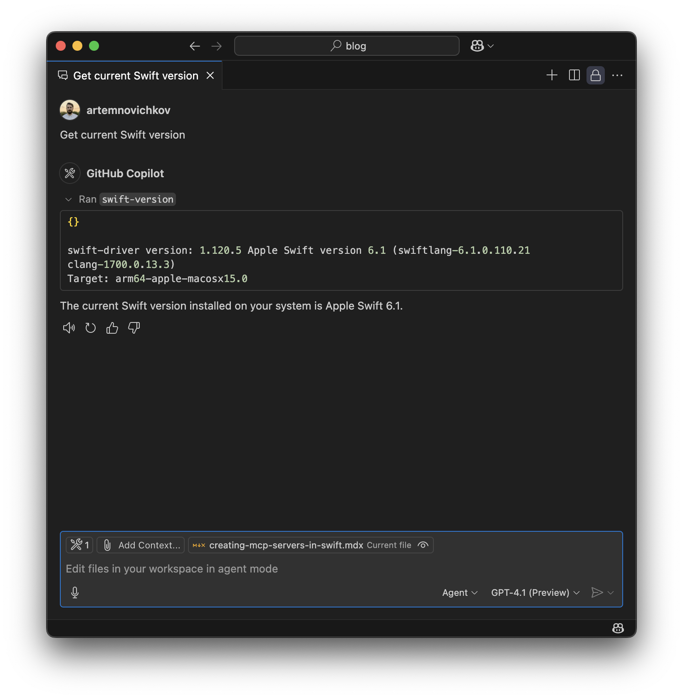
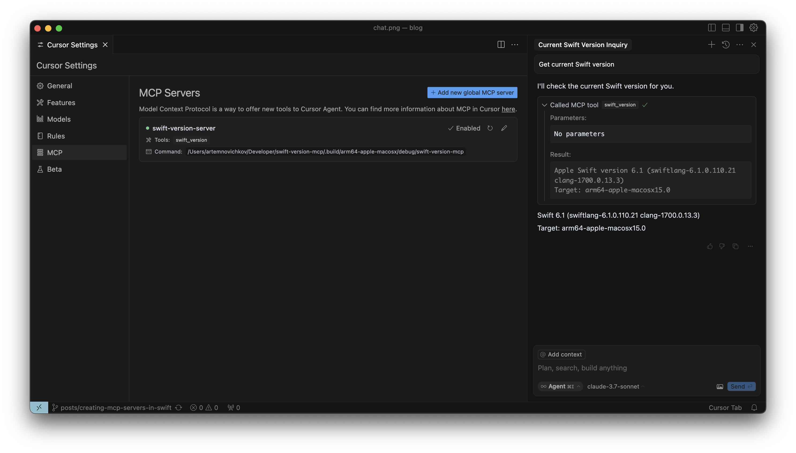
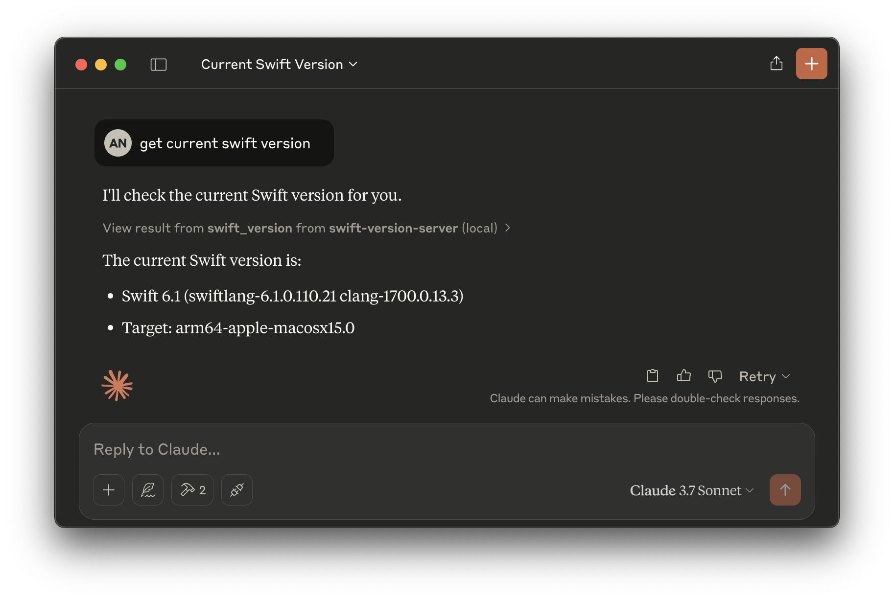

# Creating MCP Servers in Swift

An example project for [Creating MCP Servers in Swift](https://www.artemnovichkov.com/blog/creating-mcp-servers-in-swift) article.

  
    
  
    
  

## Author

Artem Novichkov, https://www.artemnovichkov.com/

## License

The project is available under the MIT license. See the [LICENSE](./LICENSE) file for more info.
